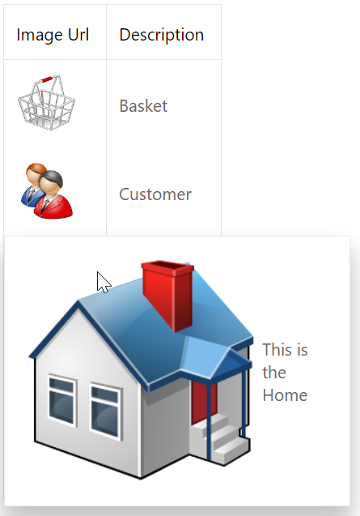

<!-- default badges list -->

[](https://supportcenter.devexpress.com/ticket/details/E4872)
[](https://docs.devexpress.com/GeneralInformation/403183)
<!-- default badges end -->
# Grid View for ASP.NET Web Forms - How to show a popup with an enlarged image on mouse hover

This example demonstrates how to create a templated column, add an image to the template, and display the enlarged image in a pop-up window on mouse hover.



## Overview

Specify a column's [DataItemTemplate](https://docs.devexpress.com/AspNet/DevExpress.Web.GridViewDataColumn.DataItemTemplate) property and add an image control to the template. Specify the image's [ImageURL](https://docs.devexpress.com/AspNet/DevExpress.Web.ASPxImage.ImageUrl) property to bind the image control to the grid's data source.

```aspx
<dx:ASPxGridView ID="ASPxGridView1" runat="server" ClientInstanceName="grid"
    OnHtmlDataCellPrepared="ASPxGridView1_HtmlDataCellPrepared" AutoGenerateColumns="False">
    <Columns>
        <dx:GridViewDataColumn FieldName="ImageUrl" VisibleIndex="0">
            <DataItemTemplate>
                <dx:ASPxImage ID="ASPxImage1" runat="server" ImageUrl='<%# Eval("ImageUrl") %>'
                    Width="50px" Height="50px" />
            </DataItemTemplate>
        </dx:GridViewDataColumn>
        <dx:GridViewDataTextColumn FieldName="Description" ReadOnly="True" VisibleIndex="1" />
    </Columns>
</dx:ASPxGridView>
```

Create a popup control, populate its content with an image and a label, and specify the image's width and height to make the image enlarged.

```aspx
<dx:ASPxPopupControl ID="ASPxPopupControl1" runat="server" ShowHeader="false" ClientInstanceName="popup"
    CloseAction="MouseOut">
    <ContentCollection>
        <dx:PopupControlContentControl runat="server" SupportsDisabledAttribute="True">
            <table>
                <tr>
                    <td>
                        <dx:ASPxImage runat="server" ID="Image" ClientInstanceName="clientImage"
                            Height="200px" Width="200px" />
                    </td>
                    <td>
                        <dx:ASPxLabel runat="server" Text="Desc" ClientInstanceName="clientLabel" />
                    </td>
                </tr>
            </table>
        </dx:PopupControlContentControl>
    </ContentCollection>
</dx:ASPxPopupControl>
```

Handle the grid's server-side [HtmlDataCellPrepared](https://docs.devexpress.com/AspNet/DevExpress.Web.ASPxGridView.HtmlDataCellPrepared) event. In the handler, add the `onmouseover` attribute to the grid cell within the `ImageUrl` column and specify the attribute's value - call the **ShowPopup** function and pass the corresponding cell values as parameters. The **ShowPopup** function invokes a pop-up window and displays the enlarged image and its description in the window.

```js
function ShowPopup(elementID, imageUrl, description) {
    if (popup.GetClientVisible())
        popup.Hide();
    clientImage.SetImageUrl(imageUrl);
    clientLabel.SetText("This is the " + description);
    popup.ShowAtElementByID(elementID);
}
```

```cs
protected void ASPxGridView1_HtmlDataCellPrepared(object sender, DevExpress.Web.ASPxGridViewTableDataCellEventArgs e) {
    if (e.DataColumn.FieldName == "ImageUrl") {
        e.Cell.Attributes.Add("onmouseover", string.Format("ShowPopup('{0}','{1}','{2}')", e.Cell.ClientID, e.GetValue("ImageUrl"), e.GetValue("Description")));
    }
}
```

## Files to Review

* [Default.aspx](./CS/Solution/Default.aspx) (VB: [Default.aspx](./VB/Solution/Default.aspx))
* [Default.aspx.cs](./CS/Solution/Default.aspx.cs) (VB: [Default.aspx.vb](./VB/Solution/Default.aspx.vb))
